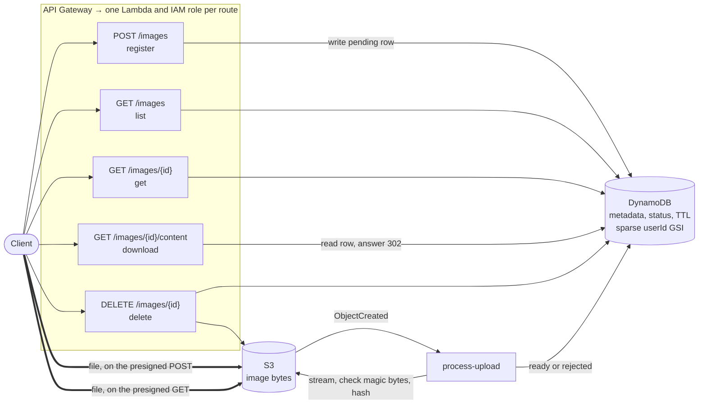

# monty-cloud — Image Service

Service layer for image upload and storage: API Gateway → Lambda → DynamoDB
(metadata), with image bytes going **directly** between clients and S3 on
presigned URLs. Terraform and LocalStack provide a full local stack.



Thick arrows carry image bytes. None pass through API Gateway or Lambda.

- **Language / runtime**: Python (Lambda `python3.12`; source targets 3.7+ syntax)
- **Infrastructure**: Terraform, one configuration for both LocalStack and AWS
- **Tests**: 317 unit tests against [moto](https://github.com/getmoto/moto), 100% line coverage,
  including OpenAPI contract tests; plus a 41-check live smoke test and a Postman
  collection verified with newman

---

## Quick start

Requires Docker, Terraform ≥ 1.5 and Python 3.9+.

```bash
make install     # virtualenv + dev dependencies
make test        # 317 unit tests, no AWS or Docker needed
make up          # start LocalStack, wait for health
make deploy      # package the Lambdas and terraform apply
make seed        # load six sample images through the full upload flow
make smoke       # end-to-end check of the deployed stack
```

`make deploy` prints the base URL. Capture it for the examples below:

```bash
export API=$(terraform -chdir=terraform output -raw api_base_url)
# http://localhost:4566/restapis/<rest-api-id>/local/_user_request_
```

Tear down with `make destroy && make down`. `make help` lists every target.

---

## API

Full reference: **[docs/API.md](docs/API.md)**. Machine-readable spec:
**[docs/openapi.yaml](docs/openapi.yaml)** (OpenAPI 3.0.3). Postman collection:
**[docs/postman_collection.json](docs/postman_collection.json)**.

| Method | Path | Purpose | Success |
|---|---|---|---|
| `POST` | `/images` | Register an image; get a direct-to-S3 upload form | `201` |
| `POST` | *`upload.url`* (S3) | Upload the file itself | `204` |
| `GET` | `/images` | List and search ready images | `200` |
| `GET` | `/images/{imageId}` | View metadata in any state; poll after uploading | `200` |
| `GET` | `/images/{imageId}/content` | View or download the file | `302` |
| `DELETE` | `/images/{imageId}` | Delete an image | `204` |

Uploading is three steps — register, send the file to S3, wait for `ready`:

```bash
RESP=$(curl -sS -X POST "$API/images" -H 'Content-Type: application/json' -H 'X-User-Id: alice' \
  -d '{"filename":"sunset.png","contentType":"image/png","tags":["beach"]}')
ID=$(jq -r .image.imageId <<<"$RESP")

FORM=()
while IFS=$'\t' read -r name value; do FORM+=(--form-string "$name=$value"); done \
  < <(jq -r '.upload.fields | to_entries[] | [.key, .value] | @tsv' <<<"$RESP")
curl -sS "$(jq -r .upload.url <<<"$RESP")" "${FORM[@]}" -F "file=@sunset.png;type=image/png"

until [ "$(curl -sS "$API/images/$ID" | jq -r .status)" != pending ]; do sleep 1; done

curl -sS "$API/images?userId=alice&tag=beach&limit=10"
curl -sSL "$API/images/$ID/content" -o downloaded.png
curl -sS -X DELETE "$API/images/$ID" -H 'X-User-Id: alice'
```

Search filters — combined with AND, all optional: `userId` (indexed), `tag`,
`contentType`, `filename`, `uploadedFrom`/`uploadedTo`, plus `limit` and
`nextToken` for cursor pagination.

The caller is identified by the `X-User-Id` header, a development stand-in for
an authorizer. Errors are uniform — `{"error": "…", "code": "…"}` — with the
status codes listed in [the error reference](docs/API.md#errors).

Browse the spec in Swagger UI, with the LocalStack server preselected:

```bash
make docs   # http://localhost:8080
```

The spec is not decoration: `tests/test_openapi_contract.py` validates every real
handler response against its documented schema and checks every documented limit
and enum against the constant the code enforces, so the docs cannot drift from
the implementation without a test failing.

---

## Data model

**S3** — `images/{userId}/{imageId}.{ext}`. Both parts are server-controlled: the
id is generated, and the user id is validated to exclude `/` and anything S3
event notifications would URL-encode. Concurrent uploads never collide, and a
client cannot choose where its bytes land — the key is fixed in the signed upload
policy.

**DynamoDB** — one item per image:

| Attribute | | |
|---|---|---|
| `imageId` | string | **Partition key.** Every single-image read is by id |
| `userId` | string | GSI partition key |
| `status` | string | `pending` → `ready` or `rejected` |
| `createdAt` | string | When the image was registered |
| `uploadedAt` | string | GSI sort key. **Written only when the upload is verified** |
| `filename`, `filenameLower` | string | The second is the case-insensitive search field |
| `contentType` | string | Declared at registration; verified by the processor |
| `sizeBytes`, `checksumSha256` | | Measured by the processor; ready images only |
| `rejectionReason` | string | Rejected images only |
| `tags` | list | Normalised, de-duplicated |
| `description` | string | Present only when supplied |
| `expiresAt` | number | TTL. Set on pending and rejected rows, removed on ready |
| `s3Key`, `s3Bucket` | string | Internal; stripped before anything is returned |

The single GSI, `userId-uploadedAt-index`, exists for the dominant access
pattern of a photo service: *this user's images, newest first, optionally within
a date window*. Because `uploadedAt` sorts lexicographically in the canonical
form, the date range is a **key condition** rather than a post-read filter, so
that query stays proportional to the number of results returned.

The index is **sparse by design**. `uploadedAt` is the sort key and is only
written when an upload is verified, so pending and rejected rows are simply not
in the index — listing a user's images never reads them and needs no status
filter, at no extra cost.

---

## Design decisions

**Bytes go directly between the client and S3.** The upload endpoint registers
metadata and returns a presigned POST; the download endpoint returns a `302` to a
presigned GET. Neither Lambda nor API Gateway ever carries image bytes, which
matters because Lambda's synchronous invocation payload is capped at 6 MB. An
earlier version accepted base64 in the JSON body: base64 inflates payloads by a
third, so the real ceiling was about 4.5 MB of image, below many phone photos,
and every byte cost Lambda compute. With bytes on S3, the 20 MB limit is a product
decision, and upload throughput scales with S3 rather than with Lambda concurrency.

**A POST policy, not a presigned PUT.** A presigned PUT URL cannot constrain the
body. A POST policy can, and S3 enforces it before storing anything: the exact
key, the exact `Content-Type`, and a body of 1 byte up to the size limit. Verified
against LocalStack: a file one byte over the limit gets `400 EntityTooLarge`, an
empty file `400 EntityTooSmall`, and a tampered type or key `403 AccessDenied`.

**The size limit is S3's job.** The policy's range enforces it on every upload,
and the processor records the size it measures while hashing. The form also
carries `maxSizeBytes`, so a client can reject an oversized file before sending
any bytes; S3 refuses the upload if it does not.

**Verification happens after the upload, asynchronously.** A policy cannot check
what the bytes *are*, so an S3 `ObjectCreated` event triggers `process-upload`,
which checks the magic bytes against the declared type, streams the object once
to measure it and compute its SHA-256 (1 MiB chunks, flat memory, stopping early
if the signature is wrong or the size passes the limit), and moves the row to `ready` — or to `rejected`, deleting
the object. The cost is that an image is not listable the instant it is stored;
the client polls `GET /images/{id}`. Against LocalStack the transition takes one
to two seconds from a cold processor, and milliseconds from a warm one.

**The row is written before the upload, and `pending` is a real state.** This
reverses the order a synchronous upload needs, and is safe because nothing treats
a pending row as an image: listings cannot see it (sparse index; the scan filters
on status) and downloads refuse it with `409`. In exchange, an object can only
ever land for a row that already exists, so there is always something to
reconcile it against. Pending rows whose file never arrives expire through
DynamoDB TTL; there is no sweeper to write or operate.

**Every processor transition is conditional.** S3 event delivery is
at-least-once and races with the API. `mark_ready` and `mark_rejected` succeed
only if the row is still `pending` *and* its `s3Key` matches the object. A
duplicate event finds the row already settled and does nothing. An image deleted
while its upload was in flight has no row, so the processor deletes the object —
delete wins, and a late upload cannot resurrect it. An object at a key no row
owns is deleted on sight.

**Rejection marks the row before deleting the object.** If the delete then
fails, the retry finds a `rejected` row and deletes again. The reverse order would
strand a `pending` row whose bytes were already gone, which no retry could settle.

**The processor raises on transient errors; the API handlers never do.** The API
handlers swallow every exception into a JSON response, because a caller is
waiting. Nobody waits on the processor — what matters is whether Lambda retries.
Permanent problems (bad magic bytes, no row) are settled and not raised; S3 or
DynamoDB failures propagate so Lambda's two async retries run.

**Deletes remove metadata first.** The row is the source of truth for whether an
image exists, so it goes first. Works in any state; deleting a missing S3 key
succeeds, so a pending image with no object is not a special case.

**Downloads are a 302, with `Cache-Control: no-store`.** The presigned URL carries
signed `Content-Type` and `Content-Disposition`, so the browser still gets the
original filename. `no-store` because the URL expires, and a cached redirect would
hand out a dead link.

**Unknown request fields are rejected.** A client still sending `imageBase64` gets
a `400` naming the field, rather than a `201` for an image that will never arrive.

**Listing without a `userId` is a Scan, and says so.** With no partition key
there is nothing to query. A Scan is bounded by `limit` and paginated, which is
fine for an admin view or a small corpus, but it reads the table. Two ways out
at scale: a sharded GSI (`bucket = hash(imageId) % N` as the partition, `uploadedAt`
as the sort key) for a global reverse-chronological feed, or a search index
(OpenSearch) if tag and filename search need to be first-class. Both are
significant additions; neither is justified by the current requirement.

**Tag filtering is a `FilterExpression`, not an index.** Filters are applied
after the read, so they cut payload but not consumed capacity. Making tags
indexed means one item per image-tag pair in a `tag → imageId` adjacency
structure, which doubles write cost and adds a fan-out read. The current corpus
does not justify it; the model would extend cleanly if it did.

**One IAM role per function.** `list-images` cannot delete; `download-image`
cannot write; `process-upload` can read and delete objects but cannot create
them. A bug in any single function cannot reach past what it legitimately does.
The roles are derived from one map in `terraform/lambda.tf`, so adding a function
means adding one entry.

**On-demand DynamoDB billing.** Many users uploading at once is exactly the
bursty, hard-to-forecast pattern that provisioned capacity handles badly.

**One shared deployment zip.** The package holds no third-party code — boto3 is
in the runtime — so it is 24 KB. Splitting it per function would multiply deploy
time and buy nothing. `scripts/package.sh` normalises timestamps so an unchanged
tree hashes identically and Terraform skips the redeploy.

**Clients are created lazily and memoised.** Warm invocations reuse the
connection; tests reset the cache between cases. Configuration is read per call
rather than at import so tests can vary it without reimporting modules.

---

## Testing

```bash
make test    # 317 tests, ~35s
make cov     # with a coverage report
make lint    # ruff + terraform fmt
```

Unit tests run entirely against moto — no Docker, no credentials, no network.
They cover every handler end to end, the service and repository layers, all
validation and type rules, pagination, every filter combination, multi-user
concurrency, and the AWS-failure paths.

`tests/test_process_upload.py` (38 tests) concentrates on what an async,
client-controlled upload path gets wrong: duplicate events, deletes racing
uploads, rows changing mid-hash, objects at keys no row owns, URL-encoded keys,
hostile content that lies about its type, early termination of the hash on a bad
signature, and transient failures that must propagate so Lambda retries.

`tests/test_openapi_contract.py` keeps the documentation honest: it validates
`docs/openapi.yaml` as an OpenAPI document, validates every example in it against
its own schema, validates real handler responses — pending, ready and rejected —
against their documented schemas, and asserts that every documented limit,
default, enum and request field matches the code.

Moto signs presigned POSTs but does not enforce their policies, so the unit tests
simulate the client's upload with a direct `put_object`. What only a real S3 can
prove is covered live:

- `make smoke` — 41 checks against the deployed stack: the full lifecycle, S3
  refusing uploads that are empty, over the size limit, or carry a tampered type
  or key, the processor rejecting a PDF
  sent as a PNG, byte-for-byte download comparison, and a late upload failing to
  resurrect a deleted image.
- `npx newman run docs/postman_collection.json --env-var baseUrl=$API` — the
  Postman collection, 37 assertions, including the S3 upload and the poll loop.

Run a single test or a subset:

```bash
.venv/bin/python -m pytest tests/test_process_upload.py
.venv/bin/python -m pytest tests/test_list_images.py::test_filters_by_tag
.venv/bin/python -m pytest -k "race or duplicate or orphan" -v
```

---

## Deploying to real AWS

The same configuration targets an AWS account:

```bash
make package
terraform -chdir=terraform apply -var use_localstack=false -var environment=dev
```

`use_localstack=false` drops the endpoint overrides and the credential-check
skips, enables point-in-time recovery and CloudWatch metrics, restores the S3
lifecycle rule, scopes the S3-to-Lambda invoke permission to the account, and
turns off `force_destroy` on the bucket. Before doing this for real: attach an
authorizer to the API Gateway methods (see `terraform/apigateway.tf`), restrict
the bucket's CORS `allowed_origins` to the real front end, and move Terraform
state to a remote backend.

---

## Layout

```
src/
  handlers/     one module per API endpoint, plus process_upload for S3 events
  services/     image_service (business logic), metadata_repository (DynamoDB), object_store (S3)
  common/       config, errors, validation, response builders, the API handler decorator
terraform/      storage.tf, lambda.tf (functions, IAM, S3 notification), apigateway.tf, variables
tests/          317 unit tests, including the processor and OpenAPI contract suites
scripts/        package.sh, seed_local.py, smoke_test.py
docs/           API.md, openapi.yaml, postman_collection.json, sample.png
```

API handlers are 5–20 lines. The `@api_handler` decorator in
`src/common/middleware.py` is the global try/catch: it maps `AppError` subclasses
to their status codes, logs unexpected exceptions with a stack trace, and returns
an opaque 500 carrying only a request id — so an API Lambda cannot crash, and an
internal message cannot leak.

---

## Known limitations

- **No authentication.** `X-User-Id` is trusted. The handler-side plumbing for a real authorizer is
  already in place.
- **No authorisation.** Any caller can read or delete any image by id. Ownership
  is recorded but not enforced; enforcing it is a conditional expression on the
  delete and an ownership check on the reads.
- **No failure destination for the processor.** If an S3 event exhausts Lambda's
  two retries — a sustained DynamoDB outage, say — the row stays `pending` until
  TTL expires it, and the object is left behind. An SQS on-failure destination
  (or S3 → SQS → Lambda for backpressure) would make those replayable.
- **Global listing scans.** See the design note above.
- **No thumbnails.** The processor is the natural place to fan out to a resize
  step and record derivative keys on the row.
- **Upload status is polled.** A push channel (WebSocket API, or an EventBridge
  event on `ready`) would suit a real client better.
- **LocalStack skips two resources** (S3 lifecycle, PITR) that apply on AWS.
